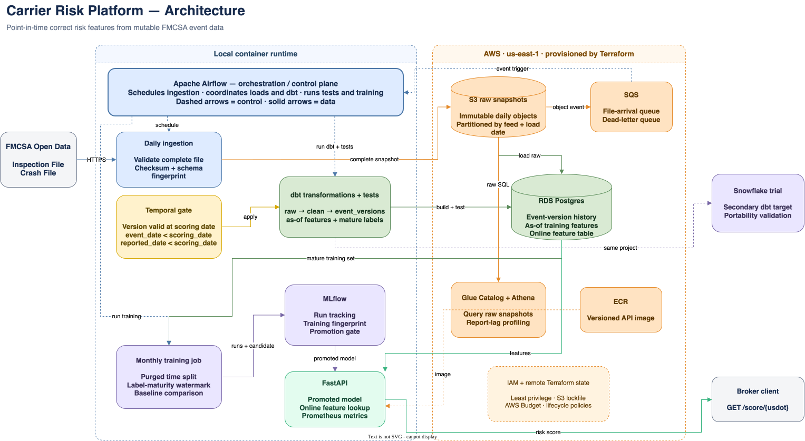
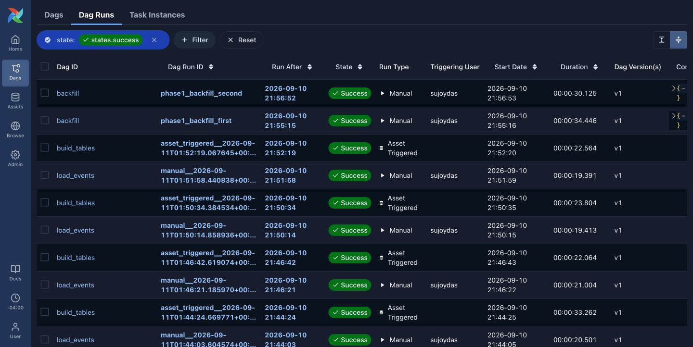
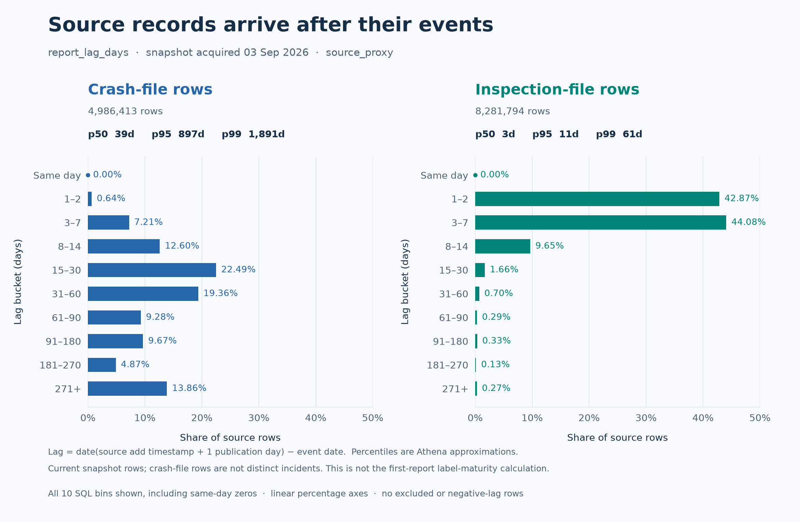
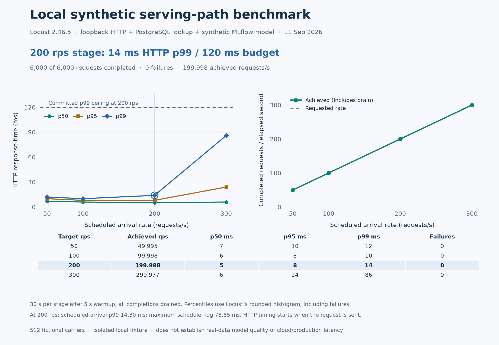

# carrier-risk-platform

A personal project for assessing US trucking companies using only the inspection
and crash records available when a hiring decision would have been made. The
deliverable is a reproducible data pipeline, with a model-training gate and API.

**Real-data training is currently blocked.** The measured reporting grace is
**495 days**, exceeding the committed nine-month limit. No federal-data model
was trained or promoted. Successful API scores and latency measurements use an
explicitly synthetic model.

## Why two clocks matter

A March 3 crash first reported on March 20 cannot inform a March 10 decision.
Checking only when it happened would let future information into training:

```sql
where event_date    < scoring_date
  and reported_date < scoring_date
```

Corrections add another requirement: select the event version knowable at that
scoring date. Immutable snapshots and versioned knowledge intervals preserve the
earlier answer when a later file changes or deletes a record. Three blocking dbt
tests detect impossible chronology, overlapping versions, and incorrect historical
features. Snowflake Time Travel follows warehouse ingestion history; it cannot
replace these source-availability checks.

## How it works

```text
FMCSA snapshots → S3 manifests → SQS → Airflow → PostgreSQL/dbt history
                                                        ↓
                                              features → MLflow → FastAPI
```

The manifest commits a validated snapshot; repeated loads and backfills preserve
the same event versions. Python handles transactional I/O, dbt resolves history
and deduplicates crash incidents, and Airflow coordinates arrivals and monthly
training. Terraform provisions the AWS resources. Local development uses
PostgreSQL, MinIO and a queue emulator. The [design decisions](docs/adr/README.md)
explain the boundaries and trade-offs.



### System evidence

The screenshots below come from the recorded acceptance runs. They connect the
flow above to the systems that actually executed it; the linked phase reports
retain commands, hashes, limitations, and cleanup evidence.

<table>
  <tr>
    <td width="50%">
      <br>
      <strong>AWS ingestion and orchestration.</strong> S3 notifications reached
      SQS, Airflow loaded PostgreSQL, and replayed backfills produced the same
      event history.
    </td>
    <td width="50%">
      <br>
      <strong>Warehouse portability.</strong> The same history models and temporal
      guards ran against Snowflake after PostgreSQL acceptance; the isolated
      trial warehouse was suspended when verification finished.
    </td>
  </tr>
  <tr>
    <td width="50%">
      <br>
      <strong>Failure recovery.</strong> A missing object failed twice, remained
      retryable, then loaded successfully after the object and manifest arrived.
    </td>
    <td width="50%">
      <br>
      <strong>Replay safety.</strong> Two bounded backfills completed through the
      normal DAG with identical raw counts and modeled-table hashes.
    </td>
  </tr>
</table>

## What the data showed

The Federal Motor Carrier Safety Administration (FMCSA) publishes the inspection
and crash feeds. The September 3, 2026 snapshots contain 4,986,413 crash rows and
8,281,794 inspection rows. Athena queried validated Parquet derivatives while preserving
the original CSV snapshots. Crash reporting lags were substantially longer:
median **39 days**, versus **3 days** for inspections.



These are **source-row, `source_proxy` distributions**: source-add time plus one
publication day estimates historical availability. A current snapshot cannot
recover earlier corrections or deleted rows. The [bucket counts and lineage](docs/evidence/phase-2/athena-results.json)
are retained.

The separate training watermark uses earliest retained source-proxy lags for
deduplicated eligible crash incidents across twelve mature monthly cohorts;
historical first versions remain unavailable. Its bootstrapped p99.5
upper bound produced the 495-day grace. The [recorded MLflow run](docs/evidence/phase-3/training-gate.json)
skipped before building a dataset or fitting. Future candidates must beat both
the recent-crash-count baseline and incumbent on a purged time holdout; no
real-data predictive improvement is claimed. [Policy and measurement details](docs/phase-3-verification.md).

## Verified behavior

These are recorded September 11, 2026 results, not a continuously deployed service.

| Evidence | Result |
|---|---|
| [AWS event pipeline](docs/phase-1-verification.md) | Missing-object retry, duplicate-message idempotency, corrections, two identical backfills, temporal tests |
| [Infrastructure and portability](docs/phase-2-verification.md) | Remote state locking, Athena reconciliation, ECR operations, PostgreSQL/Snowflake fixture parity and rollback |
| [Failure demonstrations](docs/phase-4-verification.md) | Deliberate failures, recovery evidence, and screenshot scope |

Disposable AWS resources were destroyed; original raw snapshots remain. Snowflake
was a trial-account portability exercise, and its compute was suspended after
verification. The reports retain security findings and cleanup qualifications.

## Measured API latency

The local Locust run exercised PostgreSQL lookups and an MLflow-loaded,
100-tree classifier over 512 fictional carriers. Each stage used five seconds
of warmup, thirty measured seconds, independent scheduled arrivals, and 32
persistent loopback sessions. Every scheduled request completed.

| Target rps | Achieved rps | p50 ms | p95 ms | p99 ms | Failed / completed |
|---:|---:|---:|---:|---:|---:|
| 50 | 50.00 | 7 | 10 | 12 | 0 / 1,500 |
| 100 | 100.00 | 6 | 8 | 10 | 0 / 3,000 |
| 200 | 200.00 | 5 | 8 | 14 | 0 / 6,000 |
| 300 | 299.98 | 6 | 24 | 86 | 0 / 9,000 |



**The p99 ≤120 ms at 200 rps target passed.** Scheduled-arrival p99 was 14.30 ms;
maximum scheduler lag was 78.85 ms. Percentiles include failures. This measures
the local synthetic serving path; production latency and real-data model quality
remain unproven. [Timings and hashes](docs/evidence/phase-3/latency-session-32/manifest.json)
and [earlier failed trials](docs/evidence/phase-3/latency-investigation.md) are retained.

## Run and inspect

Use Python 3.12. The [serving guide](serving/README.md) covers installation,
connections, synthetic validation and load testing. `GET /score/{usdot_number}`
returns `features_as_of` and `validation_fixture` with a score. Without a promoted
model, eligible carriers receive `model_unavailable`; insufficient inspection
history returns `insufficient_history`. Health endpoints and Prometheus metrics
make availability visible.

For other entry points, see [warehouse builds](dbt/README.md),
[monthly training](docs/phase-3-verification.md#local-operation),
[AWS operation](docs/phase-1-infrastructure.md),
[state bootstrap](infra/state-bootstrap/README.md), and
[source contracts](docs/source-schemas.md). Tests use synthetic fixtures; raw
federal data is not committed. [.env.example](.env.example) and
[Compose services](docker-compose.yml) document local configuration; the
[CI workflow](.github/workflows/checks.yml) lists check dependencies and commands.

## Deliberate exclusions

| Excluded | Reason |
|---|---|
| Historical carrier attributes | No confirmed public archive of past vintages; current attributes would leak future information |
| Separate violation feed | Inspection rows already contain every violation and out-of-service total used by v0 |
| Kafka, Kinesis and streaming | Inputs arrive as periodic file snapshots |
| Kubernetes | One stateless API does not need a cluster orchestrator |
| Spark, EMR and Databricks | These data volumes fit on a laptop |
| Managed Airflow (MWAA) | Its ongoing managed-service cost exceeds this project's needs; Airflow runs locally |
| Federal safety-score replication | The model uses underlying event records to predict a future crash outcome |

License: [MIT](LICENSE).
