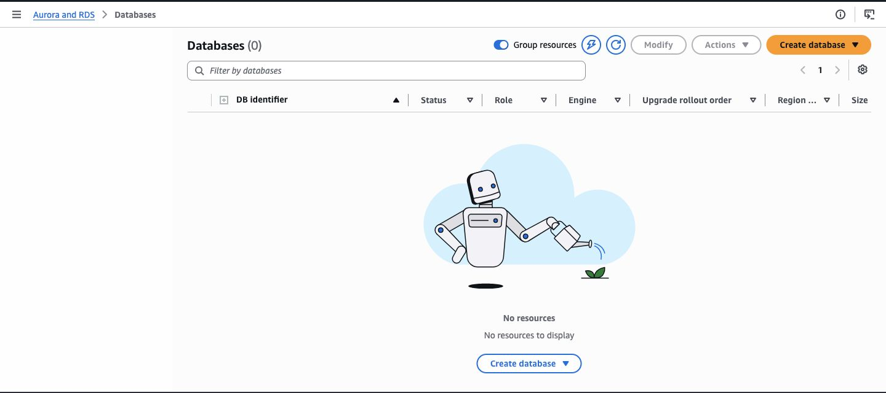
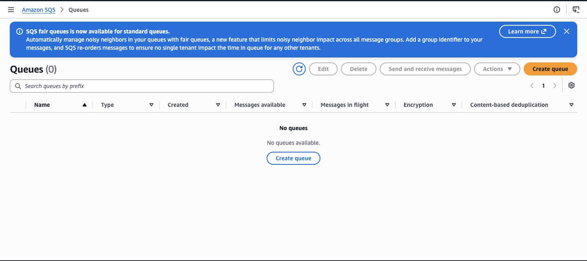

# carrier-risk-platform

Risk scoring for US motor carriers, built so that every prediction uses only the
records that were actually available on the date the decision would have been made.

## Background

Freight brokers can face negligent hiring liability when a carrier they dispatch
is involved in a crash. The Federal Motor Carrier Safety Administration (FMCSA)
publishes carrier inspection and crash histories. Inspection rows already include
violation and out-of-service totals. This project turns that public data into a
carrier risk score, helping brokers assess safety risk before dispatching a load.

## The problem it solves

Federal safety scores are recalculated each month using the previous two years of
inspections and crashes. That creates a leakage problem when those scores are used
to train a model.

Say you're trying to predict whether a carrier would crash last March.
If you train on the carrier's current safety score, that score already includes
the March crash. The model learns that carriers with bad scores tend to crash,
tests well, and isn't much help with the question that matters: which carriers
are risky before they crash?

Fixing this requires two date filters. Every event has a date when it happened,
and a date when it showed up in federal data. Those dates can be weeks apart:

```sql
where event_date    < scoring_date   -- it had happened
  and reported_date < scoring_date   -- it was visible
```

Checking only the event date still leaks information.
An inspection or crash may have already happened but not yet been reported.
At the scoring date, the model couldn't have known about it.

So each historical score has to be built from only the information that was
actually available on that date. Most implementations get the first filter
right and miss the second.

## Approach

* Ingest daily inspection and crash feeds as immutable snapshots
* Preserve corrected event versions so historical scoring uses the version that
  was knowable at the time
* Exclude present-day carrier attributes from historical features because no
  confirmed public archive provides their past versions
* Generate features for each carrier and scoring date using both the occurrence and
  reporting-date filters above
* Build labels from a forward-looking window, and only admit a row into training once
  that window has fully elapsed
* Enforce temporal correctness with tests that fail the build if future information
  leaks into a historical row
* Make every load idempotent, since carriers can dispute records and federal history
  can change after publication

## Architecture


Phase 1 implements the event spine shown across the center of the diagram:

```text
immutable S3 manifest -> SQS -> Airflow -> raw PostgreSQL -> dbt history/features
```

The manifest is published last, after the compressed snapshot and its checksums
have been validated. SQS therefore carries a small reference to committed data,
not the data itself. Airflow coordinates the load and build boundaries; Python
owns transactional I/O, while dbt owns conformance, correction-aware history,
crash-incident deduplication, and point-in-time features.

Every source event has two distinct timelines:

- the event and reported dates describe when the event happened and became
  available from the source;
- the half-open knowledge interval `[knowledge_valid_from,
  knowledge_valid_to)` describes which corrected version the warehouse knew at
  a particular instant.

This separation lets a correction change today's answer without rewriting the
answer that was knowable yesterday.

## Data

V0 uses FMCSA's Vehicle Inspection File and Crash File from the DOT open data
portal. Violation and out-of-service features come from totals on each inspection
row, so a separate violation feed is not ingested. US government work, public
domain. Raw data is not committed; tests use generated fixtures instead.

## Landing a snapshot

Authenticate to AWS and verify the existing account-level budget and credit
eligibility before provisioning resources. Follow the
[state bootstrap and migration guide](infra/state-bootstrap/README.md) to create
the backend bucket and prepare the ignored `infra/base/backend.hcl`. Then:

```bash
python3.12 -m venv .venv
.venv/bin/pip install -e '.[dev]'
terraform -chdir=infra/base init -backend-config=backend.hcl
terraform -chdir=infra/base apply
export CARRIER_RISK_RAW_BUCKET="$(terraform -chdir=infra/base output -raw raw_bucket_name)"
export CARRIER_RISK_INGEST_ROLE_ARN="$(terraform -chdir=infra/base output -raw ingest_role_arn)"
.venv/bin/python -m ingest.landing --feed inspections
.venv/bin/python -m ingest.landing --feed crashes
```

Each feed is written to a deterministic UTC-day partition. The data object is
checksummed and validated before its manifest is published as the commit marker;
rerunning a completed partition is a no-op. Manifests include a deterministic
batch identifier used by warehouse loads and backfills.

## Running Phase 1 locally

The default workflow uses only local containers. It exercises the same message,
loader, and dbt boundaries as AWS without creating cloud resources:

```bash
cp .env.example .env
docker compose up -d postgres minio elasticmq
.venv/bin/python -m tests.local_airflow_fixture
.venv/bin/pytest
```

See [the Phase 1 operator guide](docs/phase-1-infrastructure.md) before enabling
AWS. The event spine is disabled by default and its RDS/SQS resources must be
destroyed at the end of every approved working session.

## Verified behavior

The short-lived AWS acceptance run proved the complete manifest-to-feature path,
including a retryable missing-object failure, duplicate-message idempotency, a
later correction, two identical backfills, TLS-verified RDS access, and all three
blocking temporal invariants. The RDS instance, queues, and temporary VPC were
then destroyed; the immutable Phase 0 S3 evidence remains.

Exact commands, sanitized counts, temporal results, test totals, teardown checks,
and screenshot guidance are recorded in
[the Phase 1 verification report](docs/phase-1-verification.md).

### Acceptance evidence






## Stack

Airflow, dbt-core, Postgres, MLflow, FastAPI, Terraform, AWS (S3, SQS, RDS, Glue,
Athena).

## Status

Phases 0 and 1 are complete. The project can land immutable FMCSA snapshots,
load them transactionally from SQS notifications, preserve correction-aware
event history, build two-clock features, and replay bounded date ranges without
changing the result. Phase 1 was verified in AWS and its continuously billable
resources were removed after the proof.

Phase 2 is complete: remote state and lock contention, ECR artifact operations,
full-snapshot Athena reconciliation through lossless Parquet derivatives, and
Snowflake build/replay/temporal/rollback parity were verified. Temporary AWS
resources were removed and Snowflake compute is suspended. See the
[verification record](docs/phase-2-verification.md) for results, cost controls,
security findings and the limits of the acceptance scope. Model training and
serving remain Phase 3 work.

## License

MIT
