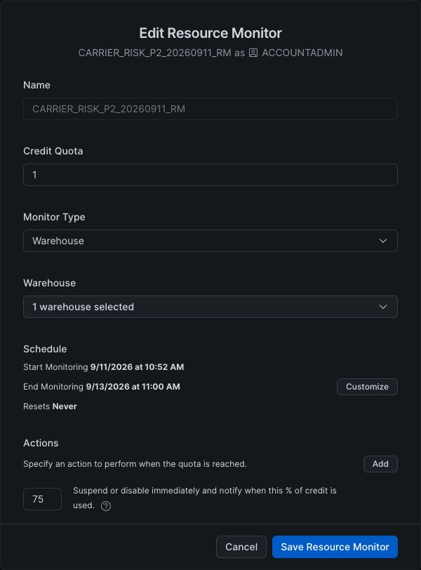
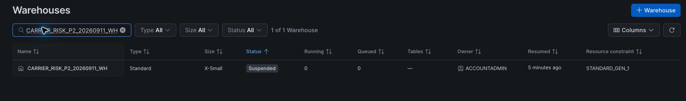

# Phase 2 evidence

Phase 2 acceptance is complete. Native screenshots below document the console
state at capture time. Machine-readable results document execution. They are not
screenshots. Scope, cleanup and limitations are in the
[verification record](../../phase-2-verification.md).

- [Full-source Parquet reconciliation](parquet-reconciliation.json)
- [Athena counts, exclusions, lag distributions and scanned bytes](athena-results.json)
- [Snowflake build, parity, replay, negative tests and atomic rollback](snowflake-semantics.json)

## Final saved resource monitor

The native console capture shows the saved one-credit, non-resetting monitor
with its final 75% immediate suspension trigger and September 13 deadline.
This supersedes the initial 25% setting described in the earlier setup evidence.
Final warehouse suspension, disabled auto-resume, zero running/queued queries and
zero writer locks were verified programmatically after acceptance.

The native management-account AWS credits capture is retained privately because
it contains account and credit identifiers. It showed $119.96 estimated remaining
and both credit expiry dates of September 2, 2027. It does not establish
organization-wide sharing or a finalized project bill.

## After the dbt guard checks, September 11, 2026

The filtered console shows the dedicated generation-1 X-Small warehouse suspended
with zero running and queued queries after the real one-row dbt seed acceptance
check and final killed-process check. This screenshot establishes the stopped state at capture time. The actual
guard, failure, and killed-process results are recorded in the verification
record. This image is not evidence of a full project dbt build. The final
killed-process check also verified suspension programmatically. The console was
recaptured with the pointer outside the frame. The displayed state is unaltered.

## Capture limitations

A full set of live Glue, Athena, ECR, lock-contention, dbt and teardown screenshots
was not obtained because of browser interruptions. Their execution evidence is
recorded in the verification record and the result files above. No reconstructed
console image substitutes for a missing native capture. The optional RDS/SQS
runtime redeployment was outside this phase. Phase 1 records its earlier proof.

Each saved capture must show an actual console or terminal state, have a clear
caption explaining its scope, and link back to the relevant command/result in the
verification record. Crop safe panels or apply opaque redaction to credentials,
account/role identifiers, endpoints, and other sensitive metadata, then inspect
the final pixels. Original captures stay outside version control. Generated
images, diagrams, and reconstructed logs cannot serve as execution evidence.

The final teardown evidence must distinguish the disposable acceptance stack from
the separately retained original raw snapshots. It must not imply that the entire
AWS account is empty.
