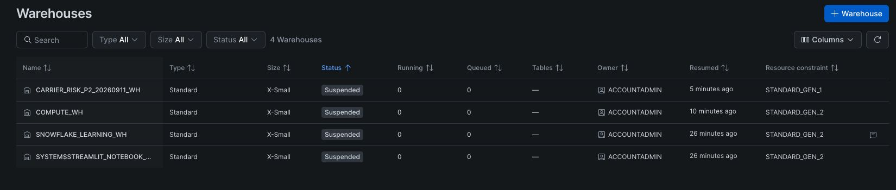

# Phase 2 evidence

The first Snowflake setup screenshot is saved below. This index records the evidence still
required. Live parser, ECR, remote-lock, and infrastructure-only cleanup results
are recorded without screenshots. Execution results and limitations are in the [verification record](../../phase-2-verification.md).

## Snowflake setup, September 11, 2026

The dedicated X-Small generation-1 test warehouse is suspended with zero running
or queued queries, alongside the three pre-existing starter warehouses. This is
setup and suspension evidence, not a successful dbt build. The project warehouse
has auto-resume disabled, 60-second idle/query limits, and a resource monitor with
a 25% immediate-suspension trigger on a one-credit, non-resetting quota. Its end
timestamp is September 13, 2026 at 15:00 UTC. Monitor configuration was verified
separately in the live SQL results; it is not visible in this screenshot.

## After the dbt guard checks, September 11, 2026

The filtered console shows the dedicated generation-1 X-Small warehouse suspended
with zero running and queued queries after the real one-row dbt seed acceptance
check. This screenshot establishes the stopped state at capture time. The actual
guard, failure, and killed-process results are recorded in the verification
record; this image is not evidence of a full project dbt build. A later final
killed-process check also verified suspension programmatically.

| Required capture | What it must demonstrate | Status |
|---|---|---|
| PostgreSQL/RDS and SQS recovery | The disposable spine is running; arrival, redrive, and replay/recovery work | Pending |
| Glue catalog | Actual schemas and selected acquisition-date partitions point only to validated raw objects | Pending |
| Athena reconciliation and lag query | Manifest/count agreement, parse/exclusion counts, result scope, scanned bytes, and query cost | Pending |
| ECR | Immutable-tag settings, the bounded acceptance image, push/pull behavior, and scan outcome | Pending |
| Remote Terraform state | Two real competing operations show lock contention and normal release | Pending |
| dbt targets and temporal failures | Real builds/contracts pass on both targets; each temporal detector rejects a deliberate violation | Pending |
| Final teardown | Empty disposable-stack state and live inventories show removal, including versions, images, queues, database, and bootstrap resources | Pending |

Each saved capture must show an actual console or terminal state, have a clear
caption explaining its scope, and link back to the relevant command/result in the
verification record. Crop safe panels or apply opaque redaction to credentials,
account/role identifiers, endpoints, and other sensitive metadata, then inspect
the final pixels. Original captures stay outside version control. Generated
images, diagrams, and reconstructed logs cannot serve as execution evidence.

The final teardown evidence must distinguish the disposable acceptance stack from
the separately retained original raw snapshots. It must not imply that the entire
AWS account is empty.
