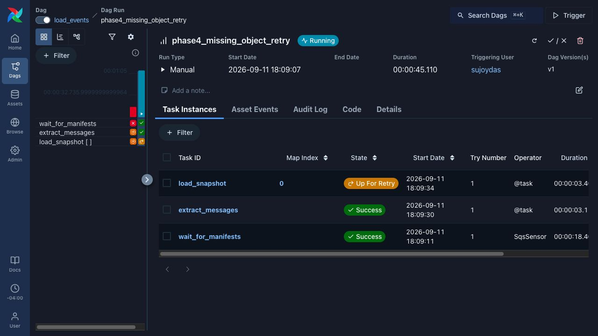
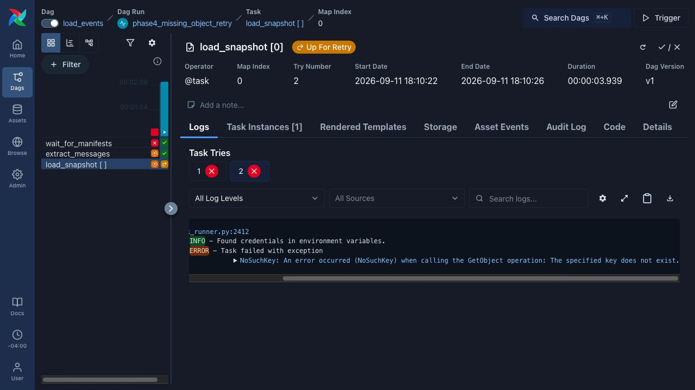
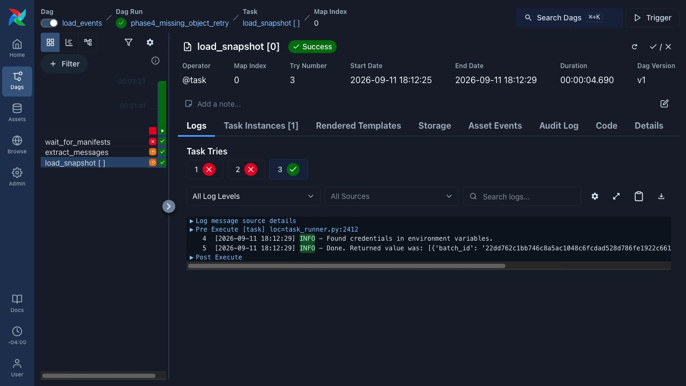
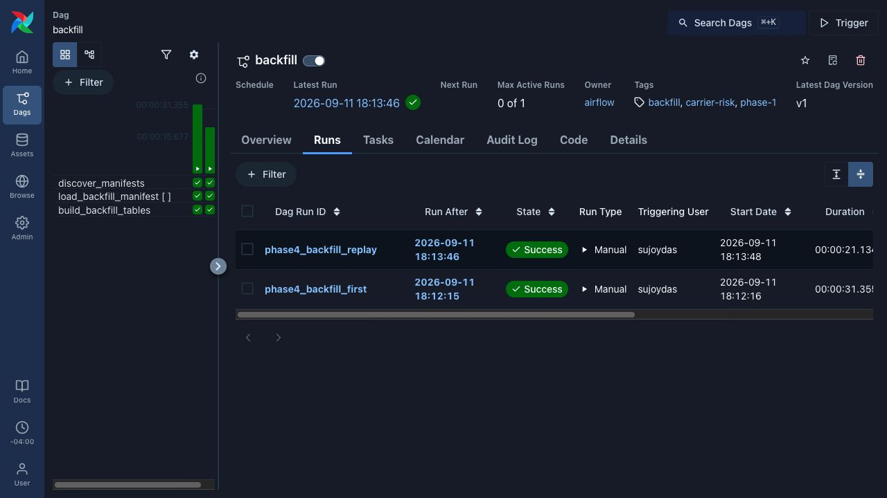

# Phase 4 verification

Phase 4 makes the project readable and its evidence inspectable. It starts from
Phase 3 commit `2a550bd` and adds the reporting-lag distribution, latency curve,
shorter README, explicit exclusions, and actual failure/recovery screenshots.
The charts reuse recorded measurements; this phase makes no new model-quality,
production-latency, or cloud-scale claim.

## Charts and the two-minute introduction

The [README](../README.md) opens with the temporal problem and the result that
matters: the 495-day measured grace prevents retrospective real-data training.
It distinguishes the source-proxy evidence from observed historical availability
and the synthetic serving benchmark from real-data model quality. Detailed
operations remain discoverable through the linked guides. Each deliberately
excluded technology has a reason.

- [Reporting-lag distribution](report_lag.png): 4,986,413 crash-file rows and
  8,281,794 inspection-file rows from the September 3 snapshots. All ten defined
  buckets are visible, including zero-count same-day bins. Counts reconcile with
  the Athena results and immutable-snapshot manifests. The approximate medians
  are 39 and 3 days. These are source-row proxies, not first-version incident
  measurements or the training watermark.
- [Latency and throughput](latency.png): the accepted September 11, 32-session
  Locust run, including all completions. At 200 requested rps, 6,000 requests
  completed with zero failures and 14 ms HTTP p99 against the committed 120 ms
  ceiling. The chart also discloses scheduler latency and the local synthetic
  scope.

The [chart provenance guide](evidence/phase-4/chart-provenance.md) provides the
reproduction command, calculation definitions, dependencies and limitations.
The [provenance JSON](evidence/phase-4/chart-provenance.json) binds inputs,
renderer and PNGs with SHA-256 hashes. Independent renders produced identical
bytes. Original Phase 2/3 evidence, including failed benchmark trials, remains.

## Actual failure and recovery

This September 11 proof ran the unchanged `load_events` and `backfill` DAGs with
Airflow 3.3.1, local MinIO, ElasticMQ and PostgreSQL. The database, bucket, queue,
Airflow metadata and ports were isolated from the earlier project services.
Four generated source rows came from
[the committed acceptance fixture](../tests/local_airflow_fixture.py): two
inspections and two commercial-vehicle reports for one crash. No federal raw
records were added to the repository or used in this demonstration.

The named `phase4_missing_object_retry` run received an S3-shaped queue message
whose manifest did not exist. `load_snapshot[0]` failed with `NoSuchKey` twice
and entered `up_for_retry`. The
[pre-repair observation](evidence/phase-4/before-repair.json) shows the message
still in flight. The snapshot object was then published through
`S3SnapshotStore`, followed by its manifest. The same mapped task recovered on
attempt 3, inserted two rows and acknowledged the message. No task was manually
marked successful or cleared to create the result.







These are unedited screenshots of the live Airflow UI. The browser displays
America/Detroit time; JSON evidence records UTC. The separate red run visible
in the left grid is an earlier demo-setup failure: Airflow's executor initially
used its default port 8080 while this isolated API listened on 8084. Setting the
execution API URL and restarting fixed that configuration. It is not counted
as the deliberate missing-object test.

## Backfill replay

`phase4_backfill_first` loaded the inspection partition, then built the pending
history and features. `phase4_backfill_replay` repeated the same feed and bounded
date range, `2026-09-04` through `2026-09-04`, through the normal discovery,
manifest loader and dbt build. Both runs succeeded on their first attempts.



| Relation | After first backfill | After replay |
|---|---:|---:|
| Completed raw batches | 2 | 2 |
| Raw crash rows | 2 | 2 |
| Raw inspection rows | 2 | 2 |
| Event versions | 4 | 4 |
| Current deduplicated events | 3 | 3 |
| Training feature rows | 1 | 1 |

Hashes of all columns in the three modeled relations match before and after
replay. The [first snapshot](evidence/phase-4/after-first-backfill.json) documents
the exact hash algorithm and empty queue; the
[recovery/replay record](evidence/phase-4/recovery-and-replay.json) contains run
times, task attempts, counts and matching hashes. These hashes are evidence for
this fixture, not a cross-version contract. The
[task-log excerpts](evidence/phase-4/task-log-excerpts.json) preserve original
outcome messages and original log-file hashes; host paths, stack frames and
queue receipt handles are excluded.

## Reproduce the demonstration

Use the Airflow environment block in [Compose](../docker-compose.yml) and
[`.env.example`](../.env.example) as the configuration reference, with a fresh
disposable database, bucket and queue. Install `.[dev,airflow]` in the project
Python 3.12 environment. This proof ran Airflow on the host, so its connections
used loopback addresses instead of Compose service names:

| Setting | Isolated proof value |
|---|---|
| PostgreSQL | `localhost:5544`, database `carrier_risk_phase4_demo` |
| MinIO endpoint | `http://127.0.0.1:9010` |
| Raw bucket | `carrier-risk-phase4-raw` |
| SQS endpoint | `http://127.0.0.1:9344` |
| Queue URL | `http://127.0.0.1:9344/000000000000/carrier-risk-phase4-arrivals` |
| dbt profile | Copy of `profiles.yml.example`, using the same PostgreSQL connection |

Set `CARRIER_RISK_DATABASE_URL`, `CARRIER_RISK_S3_ENDPOINT_URL`,
`CARRIER_RISK_SQS_ENDPOINT_URL`, `CARRIER_RISK_RAW_BUCKET`, and
`CARRIER_RISK_QUEUE_URL` accordingly. Set `CARRIER_RISK_PROJECT_DIR` to the
checkout and `CARRIER_RISK_DBT_PROFILES_DIR` to the directory containing the
copied `profiles.yml`. Supply the local database password through `PGPASSWORD`
and `POSTGRES_PASSWORD`, and local MinIO credentials through the standard AWS
environment variables. Set `AIRFLOW_CONN_AWS_DEFAULT` to the JSON connection in
Compose, replacing its endpoint with the local SQS endpoint above. These are
local emulator credentials, not cloud credentials.

Start an isolated instance from that configured shell:

```bash
export AIRFLOW_HOME="$(mktemp -d /tmp/carrier-risk-phase4-airflow.XXXXXX)"
export AIRFLOW__CORE__DAGS_FOLDER="$PWD/dags"
export AIRFLOW__CORE__LOAD_EXAMPLES=false
export AIRFLOW__CORE__DEFAULT_TASK_RETRY_DELAY=30
export AIRFLOW__API__HOST=127.0.0.1
export AIRFLOW__API__PORT=8084
export AIRFLOW__API__BASE_URL=http://127.0.0.1:8084
export AIRFLOW__CORE__EXECUTION_API_SERVER_URL=http://127.0.0.1:8084/execution/
.venv/bin/airflow standalone
```

Keep those environment settings in the shell running the commands below. The
standard four loader retries and exponential backoff remain; only this local
instance's base delay is set to 30 seconds. The proof used Airflow's local
Simple Auth Manager, and all service ports were bound to loopback.

1. Build the crash fixture with `tests.local_airflow_fixture.build_snapshot`.
   Send a notification referencing its `location.manifest_key`, but withhold both
   the object and manifest. Use the notification shape in that fixture module
   with your isolated bucket and queue settings.
2. Trigger the real DAG:

   ```bash
   airflow dags unpause load_events
   airflow dags trigger load_events --run-id phase4_missing_object_retry
   ```

3. Observe `load_snapshot[0]` fail with `NoSuchKey`. Capture its retry state and
   query the queue's visible/in-flight counts. Publish both fixture feeds using
   `build_snapshot`, `S3SnapshotStore.store_snapshot_object`, and
   `S3SnapshotStore.publish_manifest`, in that order. Allow the existing task to
   retry. Capture its successful attempt and pause `load_events` afterward.
4. Run the bounded backfill twice, retaining table counts and hashes between runs:

   ```bash
   airflow dags unpause backfill
   airflow dags trigger backfill --run-id phase4_backfill_first \
     --conf '{"feed_name":"inspections","start_date":"2026-09-04","end_date":"2026-09-04"}'
   # Wait for success and capture counts/hashes before the second command.
   airflow dags trigger backfill --run-id phase4_backfill_replay \
     --conf '{"feed_name":"inspections","start_date":"2026-09-04","end_date":"2026-09-04"}'
   ```

5. Compare counts and hashes, capture the actual UI, and remove only the
   disposable services created for the proof. Local queue notifications emulate
   S3's event shape; actual AWS delivery was separately proved in Phase 1.

## Verification fixes

The first full run found an inherited Phase 3 offline-compilation failure:
`dbt compile --no-introspect` sets `execute=true` but provides no connection for
the new label-maturity guard's registry lookup. That lookup is now restricted
to PostgreSQL `test` and `build`; actual validation and the nine-month policy are
unchanged. A new regression failed before the fix and passes afterward.

The portability test also still expected only the original three temporal
guards. It now verifies those same three guards and the exact four-test set,
including `label_maturity_policy`. All four must remain blocking and compile
to nonempty SQL. No tests, assertions or quality thresholds were removed.

The fresh full suite passed **437 tests** in 1,368.08 seconds, but its project
coverage was **86.88436830835117%**, below the committed
**88.09963099630997%** baseline. Phase 3's published coverage included a separate
manual serving smoke run; the regular suite did not exercise the fixture CLI.
That gap is now covered by
[a committed integration test](../tests/test_serving_cli_smoke.py).

The test calls the real fixture CLI twice with local PostgreSQL and MLflow,
checks all 512 persisted feature and inspection rows across replay, verifies
the registered model and synthetic tags, serves a real fixture score, and
confirms production mode rejects the same model. It restores MLflow's tracking
URI and removes only its newly created fixture database. This is an execution
and isolation test; it does not replace the recorded latency acceptance run.

The standalone smoke passed, followed by **95 passing serving/MLflow tests** in
one process, including the new smoke and the neighboring tests. Final coverage
combines the fresh full suite with these successful follow-up runs against
unchanged production Python sources: **88.38329764453961%**, comprising
2,669/2,950 statements and 633/786 branches. The failed first measurement and
development logs remain separately identified; their coverage was excluded from
the final combination. No threshold was lowered.

The [quality record](evidence/phase-4/quality-checks.json) retains commands,
versions, exact counts, original/final coverage, log hashes and the baseline
fingerprints of all 40 production Python files. The changed-production-line
coverage check has zero applicable lines. Ruff, formatting, strict mypy, the
floor guard and the public-source secret scan are also recorded there.

## Cleanup

The three Phase 4 containers were removed, including the PostgreSQL anonymous
data volume. The Airflow instance and temporary README preview stopped, and all
six dedicated loopback ports were closed. Earlier project containers remained
present. The [cleanup record](evidence/phase-4/cleanup.json) captures this check
and the hashes of the four unedited screenshots.

Phase 4 created no cloud resources. Its cleanup record covers this local proof;
the original AWS and Snowflake lifecycle evidence remains in the Phase 1/2
reports.
